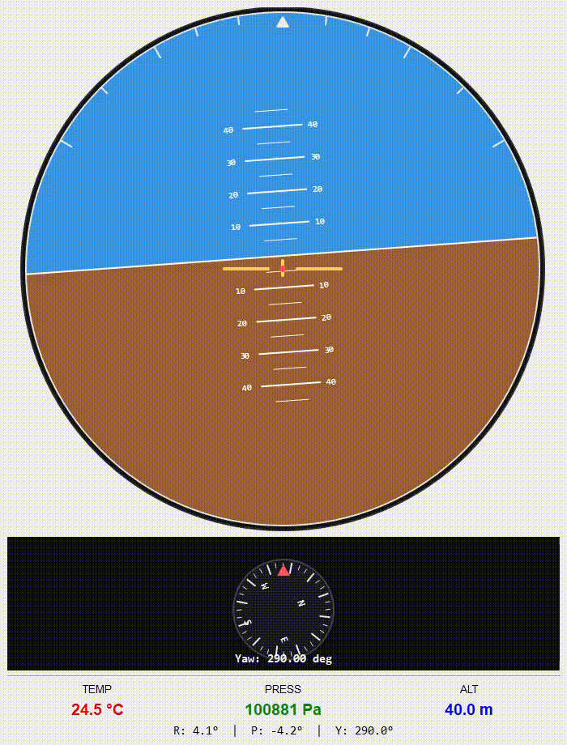

# Arthor Telemetry (STM32 Nucleo F334R8 + Python GUI)

Projekt prezentuje prosty tor telemetrii lotu:

1. `STM32 Nucleo-F334R8` odczytuje dane z czujnikow umieszczonych na GY-87 (BMP180 + MPU6050).
2. Firmware wysyla ramki telemetryczne przez UART (Virtual COM przez ST-Link).
3. Aplikacja `arthor.py` odczytuje COM i wizualizuje dane (sztuczny horyzont, yaw, wartosci baro/IMU).



## Co robi firmware

Plik: `Core/Src/main.c`

- Odczyt BMP180:
  - temperatura (`T`)
  - cisnienie (`P`)
  - wysokosc (`A`)
- Odczyt MPU6050:
  - gyro + accel
  - obliczenia `Roll`, `Pitch`, `Yaw` (filtr komplementarny)
- Wysylka danych przez UART2 (`9600`, `8N1`) w formacie tekstowym.

Format ramki (zgodny z `sprintf` w `main.c`):

```text
[BARO] T:%d.%dC P:%dPa A:%d.%dm | [ATT] R:%d.%d P:%d.%d Y:%d.%d
```

Przyklad:

```text
[BARO] T:24.3C P:100845Pa A:40.7m | [ATT] R:-1.2 P:3.4 Y:182.8
```

## Aplikacja PC (`arthor.py`)

`arthor.py` to glowny plik aplikacji desktopowej. Program:

- otwiera port COM (ST-Link Virtual COM Port),
- odczytuje linie telemetryczne z UART,
- parsuje wartosci `T, P, A, Roll, Pitch, Yaw`,
- wyswietla je na interfejsie (horyzont + kompas yaw + wartosci liczbowe).

## Wymagania

- STM32 Nucleo-F334R8
- Czujniki:
  - BMP180 (I2C)
  - MPU6050 (I2C)
- Python 3.10+ (zalecane)
- Biblioteki Python:
  - `pyserial`
  - `PyQt5`

Instalacja bibliotek:

```bash
pip install pyserial PyQt5
```

## Szybki start

1. Wgraj firmware na Nucleo.
2. Podlacz plytke przez USB (ST-Link VCP).
3. Uruchom aplikacje:

```bash
python arthor.py
```

4. Upewnij sie, że baudrate w aplikacji zgadzaja sie z firmware (`9600`).

## Struktura projektu

- `Core/Src/main.c` - glowna logika firmware i wysylka telemetrii
- `arthor.py` - aplikacja desktopowa (glowny plik GUI)

# EN: Arthor Telemetry (STM32 Nucleo F334R8 + Python GUI)

The project presents a simple flight telemetry track:

1. `STM32 Nucleo-F334R8` reads data from sensors located on GY-87 (BMP180 + MPU6050).
2. The firmware sends telemetry frames via UART (Virtual COM via ST-Link).
3. The `arthor.py` application reads COM and visualizes the data (artificial horizon, yaw, baro/IMU values).


## What the firmware does

File: `Core/Src/main.c`

- BMP180 reading:
  - temperature (`T`)
  - pressure (`P`)
  - altitude (`A`)
- MPU6050 reading:
  - gyro + accel
  - `Roll`, `Pitch`, `Yaw` calculations (complementary filter)
- Data transmission via UART2 (`9600`, `8N1`) in text format.

Frame format (compatible with `sprintf` in `main.c`):

```text
[BARO] T:%d.%dC P:%dPa A:%d.%dm | [ATT] R:%d.%d P:%d.%d Y:%d.%d
```

Example:

```text
[BARO] T:24.3C P:100845Pa A:40.7m | [ATT] R:-1.2 P:3.4 Y:182.8
```

## PC application (arthor.py)

arthor.py is the main file of the desktop application. The program:

- opens the COM port (ST-Link Virtual COM Port),
- reads telemetry lines from UART,
- parses the values `T, P, A, Roll, Pitch, Yaw`,
- displays them on the interface (horizon + yaw compass + numerical values).

## Requirements

- STM32 Nucleo-F334R8
- Sensors:
  - BMP180 (I2C)
  - MPU6050 (I2C)
- Python 3.10+ (recommended)
- Python libraries:
  - `pyserial`
  - `PyQt5`

Library installation:

```bash
pip install pyserial PyQt5
```

## Quick start

1. Upload the firmware to Nucleo.
2. Connect the board via USB (ST-Link VCP).
3. Run the application:

```bash
python arthor.py
```

4. Make sure that the baud rate in the application matches the firmware (`9600`).

## Project structure

- `Core/Src/main.c` - main firmware logic and telemetry transmission
- `arthor.py` - desktop application (main GUI file)

